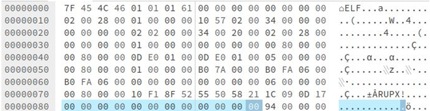

# [FOMCTE005.001](https://github.com/blue101010/FOM/blob/main/countertechniques/FOMCTE005.001.md) - Repair p_info header on UPX

## Tactics

[FOM tactics](https://github.com/blue101010/FOM/blob/main/tactics/tactics.md)

| FOM related tactics  |
| --------------------------------------- |
| [ |

## Sub-techniques related

| FOM related  Sub-techniques IDs and names|
| ------------------------------------------------------------ |
|  xx   |

## Counter-techniques related

| Counter-techniques ID                                                     | Name       | Description |
| ------------------------------------------------------------ | ---------- | ----------- |
| [FOMCTE003.001](https://github.com/blue101010/FOM/blob/main/countertechniques/FOMCTE003.001.md) | Repair p_info header on UPX| TBC         |

## Tools

TBD

## Details

Some C code to repair corrupt p_info header on UPX! packed malware. It fixes two variants found that are pretty common. There are many other variants that have UPX headers either stripped, or null bytes injected to change offsets that this code does not work on.

“p_info” is a 12-byte section in the UPX packed program header. Below, it can be observed filled with zeros:

Source : <https://vcodispot.com/corrupted-upx-packed-elf-repair/>

UPX uses a data compression algorithm called UCL,[5] which is an open-source implementation of portions of the proprietary NRV (Not Really Vanished)[6] algorithm.[2]

UCL has been designed to be simple enough that a decompressor can be implemented in just a few hundred bytes of code. UCL requires no additional memory to be allocated for decompression, a considerable advantage that means that a UPX packed executable usually requires no additional memory.

UPX (since 2.90 beta) can use LZMA on most platforms; however, this is disabled by default for 16-bit due to slow decompression speed on older computers (use --lzma to force it on).
Source: <https://en.wikipedia.org/wiki/UPX>

## Writeups and Sources

- (1) [akamai-security-research (2024, January 13). UPX Fixer. Retrieved January 13, 2024.](https://github.com/akamai/akamai-security-research/tree/main/UPX)
