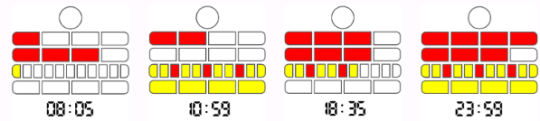

# CTFTTE-FOR-014 — Conceal information with Mengenlehreuhr diagrams encoding

> **Type:** Design / Hide Technique  
> **Tactic:** [`CTFT-TA-FOR`](../tactics/CTFT-TA-FOR.md) — Forensics  
> **Paired counter-technique:** [`CTFTCTE-FOR-014`](../countertechniques/CTFTCTE-FOR-014.md)  

---

## How the challenge author hides

Conceal information with [Mengenlehreuhr](https://en.wikipedia.org/wiki/Mengenlehreuhr) diagrams encoding.

Exemple:

 
 
 See [2024 - NSEC -  Dorsolateral Challenge](https://github.com/blue101010/writeups/blob/main/2024/NSEC/Dorsolateral/dorsolateral.md)

## Related MITRE ATT&CK

| ATT&CK ID | ATT&CK technique | Relation note |
| --- | --- | --- |
| T1027 | Obfuscated Files or Information | Diagram encodings are CTF-specific obfuscation ATT&CK omits. |

## Tools

_See references._

## References

## Tactics

[FOM tactics](https://github.com/blue101010/FOM/blob/main/tactics/tactics.md)

| FOM related tactics  |
| --------------------------------------- |
| [FOMTA007 - Use special encoding system to hide data](https://github.com/blue101010/FOM/blob/main/tactics/FOMTA007.md)  |

## Fom Related Sub-Techniques (St)

| FOM Sub-techniques ID and description  |
| --------------------------------------- |
| XXX   |

## Fom Related Counter-Techniques (Ct)

| FOM Counter-Techniques ID and description  |
| --------------------------------------- |
| [FOMCTE010.001 - Retrieve information from Mengenlehreuhr diagrams encoding](https://github.com/blue101010/FOM/blob/main/countertechniques/FOMCTE010.001.md)   |

**Sources**

- (1) [Mengenlehreuhr dodona.be](https://dodona.be/en/courses/1/series/279/activities/527398301/)
- (2) [Mengenlehreuhr Wikipedia](https://en.wikipedia.org/wiki/Mengenlehreuhr)

**Writeups**

- (1) [2024 - NSEC -  Dorsolateral Challenge](https://github.com/blue101010/writeups/blob/main/2024/NSEC/Dorsolateral/dorsolateral.md)
